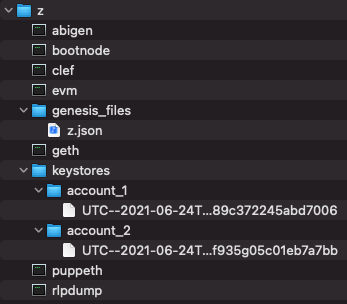
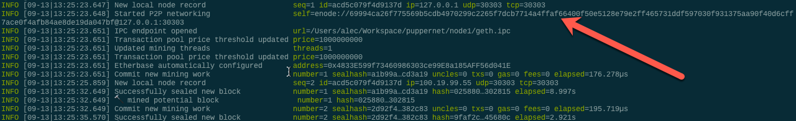

# Proof of Authority Development Chain

## Part 1. Initial Setup
The following is a list of everything you'll need to run on your local machine to replicate this project:

<br>

___

<br>

**1. [Anaconda](https://docs.anaconda.com/anaconda/install/index.html)** 

<br>

___

<br>

**2. An Anaconda environment named 'ethereum' with the following packages:**
- [os](https://pythonprogramming.net/python-3-os-module/)
- [web3](https://pypi.org/project/web3/)
- [dotenv](https://pypi.org/project/python-dotenv/)
- [bit](https://pypi.org/project/bit/)
- [eth-account](https://pypi.org/project/eth-account/)
- [pathlib](https://pypi.org/project/pathlib/)
- [getpass](https://pypi.org/project/getpass4/)

If you're not familliar with what conda environments are, [this video](https://www.youtube.com/watch?v=1VVCd0eSkYc&ab_channel=TheJacksonLaboratory) provides a good introduction.


<br>

___

<br>


**3. The [MyCrypto](https://download.mycrypto.com/) Desktop App**

<br>


<br>

**Note:** my Mac tried to block me from opening this when I initially tried to open MyCrypto. Holding 'ctrl' whilst right clicking the app and clicking 'open' did the trick for me. To avoid doing this every time, navigate to System Preferences > Security & Privacy > 'click the lock to make changes' and > 'Allow apps downloaded from: App Store and identified developers' <br>


<br>

___

<br>

**4. Network Boot files from [GoEthereum](https://geth.ethereum.org/downloads/)** 

<br>

**Note:** Make sure you download 'Geth & Tools' from 'Stable Releases'


<br>

Once you've downloaded the .gz package, unzip the files and confirm you have all of the tools in the screenshot below - 'geth' in particular. 

<br>


<br>

___

<br>

**5. A well-structured 'blockchain_archive' directory**

<br>

Full disclosure, when launching your own network, you're likely to make a few mistakes here and there. If you mess up a network, or if you lose access to one, it's best **not** to simply delete the directory files, as this can lead to all sorts of problems later on. <br>

I recommend creating an all encompassing archive folder with the 'boot_files' downloaded from the GoEthereum step above. Each time I want to set up a new network, I simply copy and rename the 'boot_files' folder to something new.

<br>


<br>

___

<br>

**6. A Notebook App (for taking down login credentials and logs)**

<br>

I use OneNote, because it allows me to quickly and easily insert screenshots into notes if required.

<br>

___

<br>

**7. MyCrypto Wallets X2**

<br>

**7.1** Swap to Kovan. <br>

Now, let's fire up MyCrypto and swap to the Kovan Test Network. Kovan is a Proof-of_Authority Testnet for Ethereum.


<br>

For all the skimreaders such as myself out there, I want to start by saying you need to do the following steps (at least) **twice** and build (at least) two separate wallets. This will be important for our web3 tests in python later.

<br>

**7.2** Build your wallet with a keystore file. <br>

You may wish to build a 'keystores' folder in your directory for convenience. Remember to make note of the password in your notebook. Full disclosure, this isn't a secure way to store these files, so you wouldn't likely store them this way in a production environment - or if you ever intended to transfer actual money into these. However, for testing purposes, it's fine/convenient for now. 


After saving the UTC file, you will also be prompted to download a 'paper wallet'. [Here's an article](https://blockgeeks.com/guides/paper-wallet-guide/) on what they are. <br>

<br>

**7.3** Sign in to the wallet, save the address and private keys in your notes <br>

<br>


**7.4** Confirm your wallet setup <br>

<br>

If you've followed all the steps, your notes should look something like this:

<br>

```
Account 1
Public Key: 0xf89395cec3658a12ced147f689c372245abd7006
Private Key: xxxxxxxxxxxxxxxxxxxxxxxxxxxxxxxxxxxxxxxxxxxxxxxxxx
Password: xxxxxxxxxxxx
```

<br>

```
Account 2
Public Key: 0x239b3bfc5fc006ae9886fa3f935g05c01eb7a7bb
Private Key: xxxxxxxxxxxxxxxxxxxxxxxxxxxxxxxxxxxxxxxxxxxxxxxxxx
Password: xxxxxxxxxxxx
```

<br>

Now is where the fun begins.


<br>

---

<br>


### **2.1 - Build a Genesis Block**

<br>

Fire up terminal, and activate the 'ethereum' environment specified in the initial setup - item 2. Then, `cd` your way to the relevant directory where you're storing your network files. Once you're in there, run the following command to launch the 'puppeth' file: <br>

```
./puppeth
```

<br>

Note: If the `./puppeth` command doesn't work, you could simply navigate to and click the puppeth file in Finder. When you eventually export the genesis file though, you'll have to specify a relative path from the 'username' root folder down to the specific directory.

<br>


<br>

Once puppeth is up and running, give the network a name you want, and then follow the following configuration prompts in the screenshot below.

<br>

When you are eventually prompted with 'which accounts are allowed to seal' - this is where you copy in the public keys / addresses from the accounts you created earlier on MyCrypto. Remember to copy everything in **AFTER** the '0x'. Do the same thing for the following 'funding' prompt.

<br>

At eventually you are prompted to specify a chain/network ID. You'll want to create a uniqe one for each new network you build. Remember to write the network ID down in your notes. It will come important later.

<br>

This will spawn a genesis block. After this, you'll need to export the genesis configurations to the master directory. Create a new folder by simply typing in the name of the chain. 

<br>


<br>

After this, your folder directory should look something like this. 

<br>




<br>

Go ahead and delete the 'harmony.json' file. You won't need it.


<br>

---

<br>

### **2.2 - Build Nodes**


<br>

Exit the `puppeth` interface by hitting `ctrl + c`. Now, create data directories for a couple of nodes using the `geth` command and a couple of command line flags.

<br>

Now type the following commands into the command line to **build** a couple of blockchain nodes.

```
./geth account new --datadir node1
./geth account new --datadir node2
```

You'll need to input a password for each, remember to note these down.

<br>

Once you've run the commands, copy the logs from your terminal into your notes. They should look something like this:


<br>

After this, you'll need to **initialise** the nodes with the following command:

```
./geth init sub_directory/network_name.json --datadir node1
```

<br>

In my case, it was the following: <br>

```
./geth init genesis_files/z.json --datadir node1
./geth init genesis_files/z.json --datadir node2
```

<br>

***

<br>

### 2.3 - Kick Start the Nodes

<br>

#### **2.2i - Node 1** <br>

To start mining the first node, run the command: <br> 

```
./geth --datadir znode1 --mine --minerthreads 1 --rpc.allow-unprotected-txs --unlock "<PUBLIC ADDRESS OF FIRST WALLET (WITHOUT '0x' AT START)>" --allow-insecure-unlock --password <PASSWORD SET FOR NODE 1 EARLIER>
```

* The `--mine` tag instructs the node to mine new blocks.
* The `--minerthreads` tag tells geth how many 'workers' / CPU threads to use. In our case, difficulty is low, we set it to 1.
* The `--unlock` tag unlocks the node for use 
* the  `password` is required to actually unlock the node. Without this, you'll be stuck 'looking for peers' into perpetuity.
* The `--allow-insecure-unlock` tag allows us to unlock in an insecure mananer 
* The `--rpc` tag allows this node to communciate via the internet <br>

<br>

Congratulations, your first node should be up in lights.

<br>


#### **2.2i - Node 2** <br>

Now, open a new terminal (do not close the existing terminal session). Again, activate the 'ethereum' environment, and navigate to the directory with all the key files in it with 'cd'. <br>

Before moving onto the next step, navigate back to the terminal session running the first node. Scroll up until you see the following 'enode' address. 



Now that you've located the line, copy to your clipboard everything following `'self='`. <br>

Now, to start mining the second node, run the command: <br> 
```
./geth --datadir znode2 --port 30304 --bootnodes "enode://28fe67f78d07...<copied from previous node>...89d69d3@127.0.0.1:30303"
```

<br>

***

<br>


### **2.4 Execute Transaction on New Network** <br>

Now, fire up the 'MyCrypto' app. Similarly to what you did before, you're now going to change from the Kovan network to your new custom network.

Change Network > Add Custom Node > [see screenshot below for input details]<br>

Remember to specify the network ID you made note of when you configured the genesis file back in step 2.1. <br>


Now that the network is set up, navigate to "View & Send" in the top left. You'll be prompted to sign in again. You could use the "Keystore File" or the private key - whatever is easiest for you. <br> 

Once you've signed in, you'll realise that youre a multi-trillion-billion-jillionaire.


Now you're ready to send some crypto. Copy the public address of wallet two into the "To Address" input box. Choose how much ETH you would like to send, click "Send Transaction" <br>


